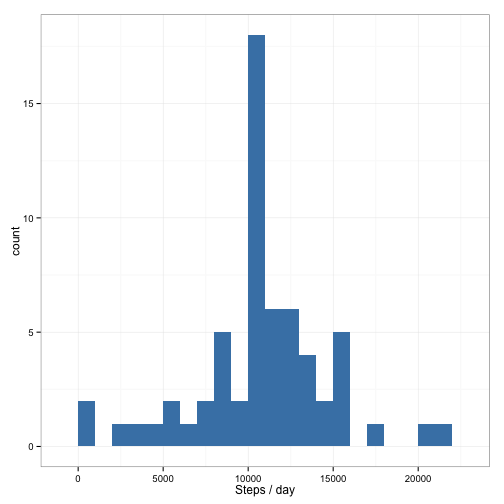

This document analyses data on the number of steps taken across 5 minute intervals over a two month period by an annonymous user.

## Loading and preprocessing the data

The data for this study is included in the repository as a zipped file. It can be read as follows,

```r
data <- read.csv(unz("activity.zip", "activity.csv"))
```

The only data processing required is to transform the variables of the `date` column from factors to objects of class `Date`, which represent calendar dates.


```r
data$date <- as.Date(data$date)
```

The data is provided pre-processed and no further cleaning was applied.

The following R packages were used as part of this data analysis:

```r
library(plyr)
library(ggplot2)
```

## What is mean total number of steps taken per day?

The total number of steps taken per day is calculated by summing over all time intervals in a given day, ignoring `NA`'s in this case. The figure below shows the distribution of the total number of steps taken per day.


```r
totsteps <- ddply(data, .(date), summarise, totSteps=sum(steps, na.rm = TRUE))
ggplot(totsteps) +
    geom_histogram(aes(x=totsteps$totSteps), 
                   fill="steelblue",
                   binwidth=1000) +
    labs(x="Steps / day", y="count") +
    theme_bw()
```

 

The mean number of steps taken per day is 

```r
mean(totsteps$totSteps)
```

```
## [1] 9354.23
```

## What is the average daily activity pattern?

The figure below plots the average number of steps taken across a given day. The mean number of steps in a given 5 minute time interval is calculated across all days included in the data set. Here, `NA`'s are ignored.


```r
avgSteps <- ddply(data, .(interval), summarise, avgSteps=mean(steps, na.rm = TRUE))
ggplot(avgSteps, aes(x=interval, y=avgSteps)) +
    geom_line(colour="steelblue") +
    labs(x="5 minute interval") +
    labs(y="Mean number of steps") +
    labs(title="Steps Taken Over the Course of a Day") +
    theme_bw()
```

 

The interval containing the maximum number of steps averaged across all days is found to be

```r
avgSteps$interval[which.max(avgSteps$avgSteps)]
```

```
## [1] 835
```

## Imputing missing values

The data set as provided includes a number of missing values, represented as `NA`. There are

```r
sum(is.na(data$steps))
```

```
## [1] 2304
```
missing values included in the processed data set, representing

```r
sum(is.na(data$steps)) / length(data$steps) * 100.
```

```
## [1] 13.11475
```
percent of the entries present in the data set. The possible bias in the previous results introduced by the presence of missing values is investigated here.

To minimize this potential bias, `NA`'s are replaced with the average number of steps for the given 5 minute interval.

```r
subNA <- merge(data, avgSteps)
subNA[is.na(subNA$steps), 2] <- subNA$avgSteps[is.na(subNA$steps)]
subNA <- subNA[,0:3]
```

The total number of steps per day is then recalculated and the distribution is plotted below.

```r
totStepsNoNA <- ddply(subNA, .(date), summarise, totSteps=sum(steps, na.rm = TRUE))
##hist(totStepsNoNA$totSteps)
ggplot(totStepsNoNA, aes(x=totSteps)) +
    geom_histogram(fill="steelblue",
                   binwidth=1000) +
    labs(x="Steps / day", y="count") +
    theme_bw()
```

 

The mean total number of steps taken per day after removing the bais from `NA`'s is

```r
mean(totStepsNoNA$totSteps)
```

```
## [1] 10766.19
```
This represents a 

```r
(mean(totsteps$totSteps) - mean(totStepsNoNA$totSteps)) / mean(totsteps$totSteps) * 100.
```

```
## [1] -15.09434
```
precent change compared to simply ignoring the `NA`'s, as shown above.

The median total number of steps taken per day is 

```r
median(totStepsNoNA$totSteps)
```

```
## [1] 10766.19
```

## Are there differences in activity patterns between weekdays and weekends?

The above time series averages across all days in the week. Here we investigate the activity pattern between weekdays and weekends.

An additonal column is added to the data set with `NA`'s removed containing a factor with two levels, `weekday` and `weekend`.

```r
##library(dplyr)
wdata <- mutate(subNA, weeksplit=factor(grepl("S(un|at)", weekdays(as.Date(date), abbreviate=TRUE)), labels=c("weekday","weekend")))
```

The mean number of steps over time is then plotted separately for weekdays and weekends. 

```r
wAvgSteps <- ddply(wdata, .(interval, weeksplit), summarise, avgSteps=mean(steps, na.rm = TRUE))
ggplot(wAvgSteps, aes(x=interval, y=avgSteps)) +
    geom_line(colour="steelblue") +
    facet_grid(weeksplit ~ .) +
    labs(x="5 minute interval") +
    labs(y="Mean number of steps") +
    labs(title="Steps Taken Over the Course of a Day") +
    theme_bw()
```

 
